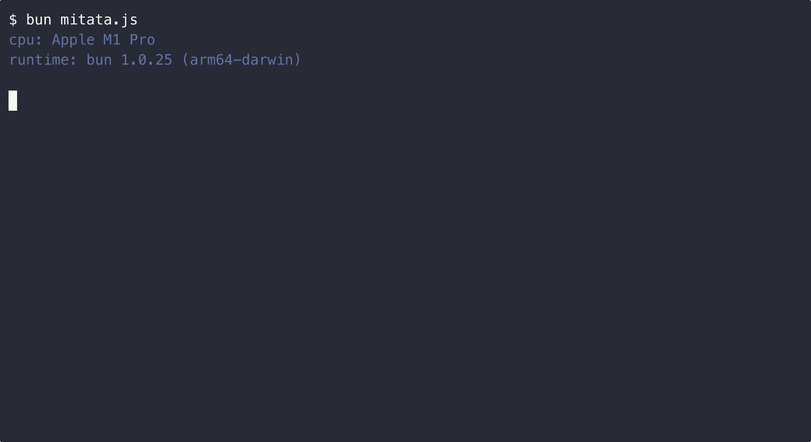

<h1 align=center>mitata</h1>
<div align=center>cross-runtime benchmarking lib</div>
<br />

<div align="center">
  </img>
</div>

<br />

## Install

### Node

```shell
npm install mitata
```

### Deno

```shell
deno add npm:mitata
```

Deno versions >= 1.40.x are supported.

The `--allow-hrtime` permission flag is recommended to allow high-resolution
time measurement.

### Bun

```shell
bun add mitata
```

Bun versions >= 1.x are supported.

### Browser

```js
<script type="module">
import {
 ...
} from 'https://cdn.jsdelivr.net/npm/mitata@0.1.11/src/cli.mjs'
</script>
```

## Example

```js
import { baseline, bench, clear, group, run } from 'mitata';

bench('noop', () => {});
bench('noop2', () => {});

group('group', () => {
  baseline('baseline', () => {});
  bench('Date.now()', () => Date.now());
  bench('performance.now()', () => performance.now());
});

group({ name: 'group2', summary: false }, () => {
  bench('new Array(0)', () => new Array(0));
  bench('new Array(1024)', () => new Array(1024));
});

await run({
  units: false, // print units cheatsheet (default: false)
  silent: false, // enable/disable stdout output (default: undefined)
  json: false, // enable/disable json output (default: false)
  colors: true, // enable/disable colors (default: true)
  samples: { warmup: 128, benchmark: 128 }, // number of benchmark samples (default: { warmup: 128, benchmark: 128, })
  avg: true, // enable/disable time (avg) column (default: true)
  min_max: true, // enable/disable (min...max) column (default: true)
  percentiles: false, // enable/disable percentile columns (default: true)
});

clear();
```

samples?: { warmup?: number; benchmark?: number; };

## Development

The JavaScript runtime environment used for development is Bun.

## License

MIT © [Evan](https://github.com/evanwashere)
